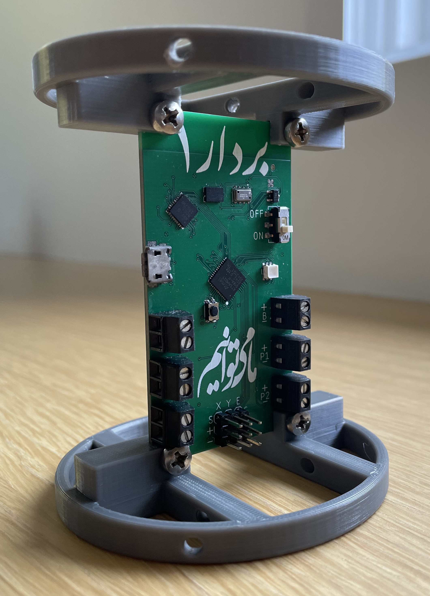

# Vector 1
Vector 1 is a thrust-vectoring model rocket computer with all the hardware required to keep your TVC model rocket upright. 

If you have any question, comments or advice on how to use the flight computer don't hesitate to open an issue.

## Feature Set

- Main microcontroller is an Atmel ATSAMD21G18 with a 32-Bit ARM® Cortex® M0+ core running at 48 MHz with 256 KB of flash. 
- High performance sensor suite with the Bosch BMI088 6-axis IMU and the TE MS5611 high accuracy barometer.
- 3 servo outputs, two for thrust-vectoring gimbal and one for a mechanical chute ejection system or any other necessary servo actions.
- 4 pyrotechnic outputs for nichrome wire, black powder parachute ejection charges or igniting a secondary motor. Pyro channels 3 & 4 are PWM capable allowing for variable current outputs through software making them more suitable for nichrome wire outputs. Continuity detection on all channels.
- DC motor driver for roll control through a reaction wheel. 
- 32 Mb non-volatile flash storage for data recording during flight along with a microSD card port to retrieve flight data after the flight.
- RGB LED and buzzer for state indication.

## Flight Software

Full flight software will be released soon for a complete electronics solution for TVC model rockets.

## Schematic & Board Preview

## Repository Contents

* **/Schematic & Board files** - Eagle design files (.brd, .sch) divided into folders based on silkscreen language and PDF of schematic
* **/Images** - Images of the built board and schematic
